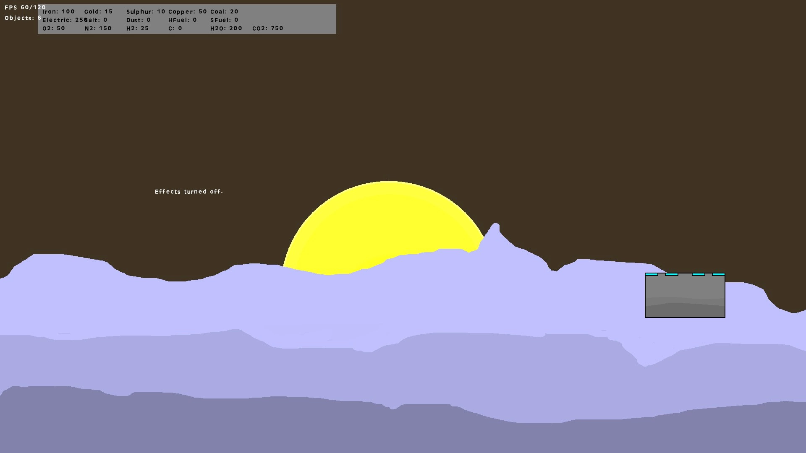
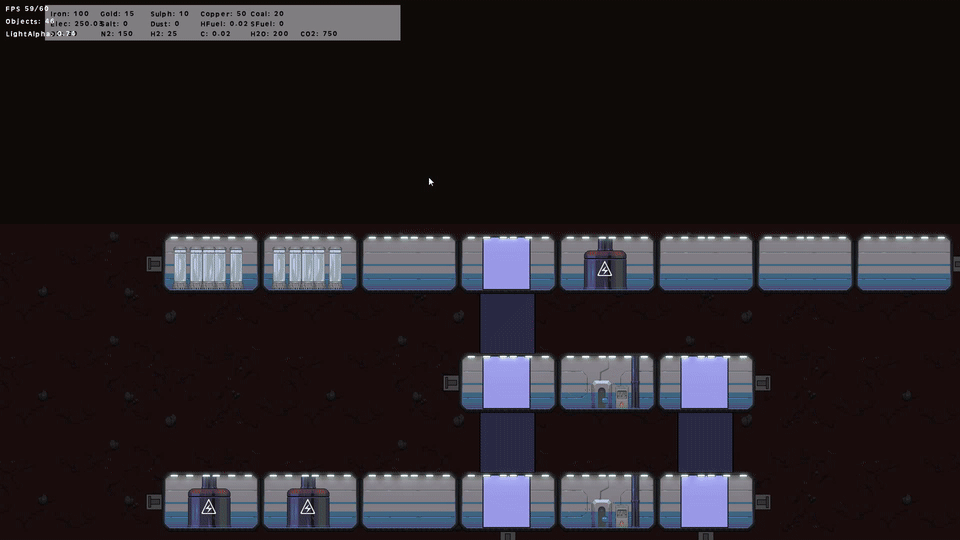
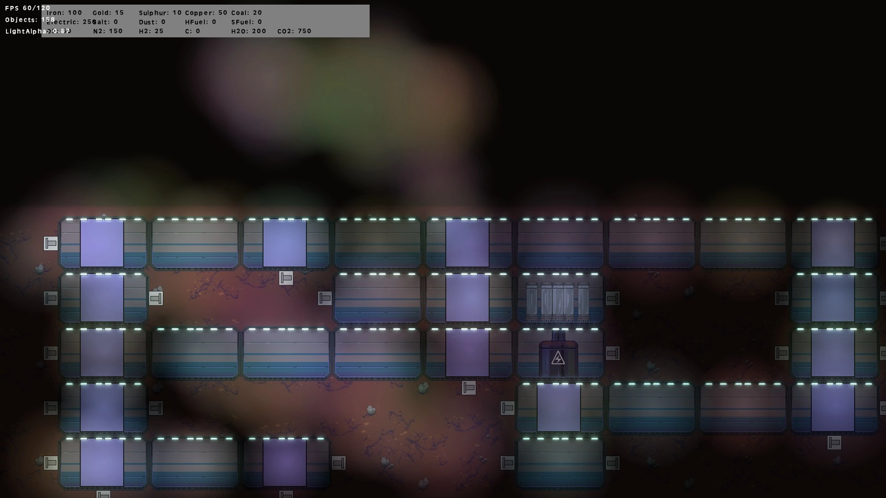
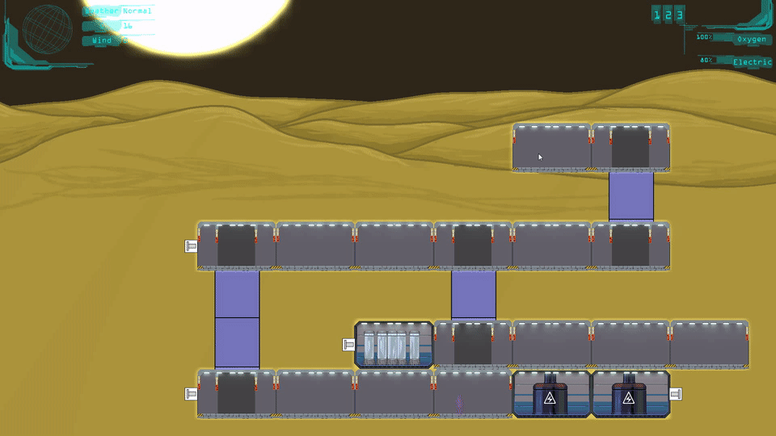

# Aetrex

This work is licensed under a <a rel="license" href="http://creativecommons.org/licenses/by-nc-nd/4.0/">Creative Commons Attribution-NonCommercial-NoDerivatives 4.0 International License (CC-BY-NC-ND)</a>.
________________

**Engine - Game Maker: Studio 1**

**Language - Game Maker Language**

**Source Code - Lost**

**Executables - Multiple versions up to latest**

**Development Date - 2016 to 2017**

________________

## Description
This project was a week challenge to see how much I can achieve in said week.

## Screenshots
 
 
 
